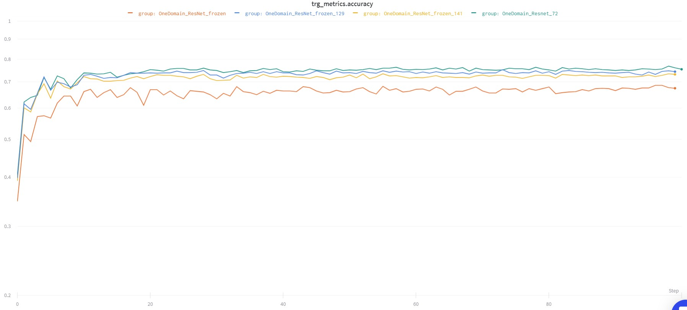
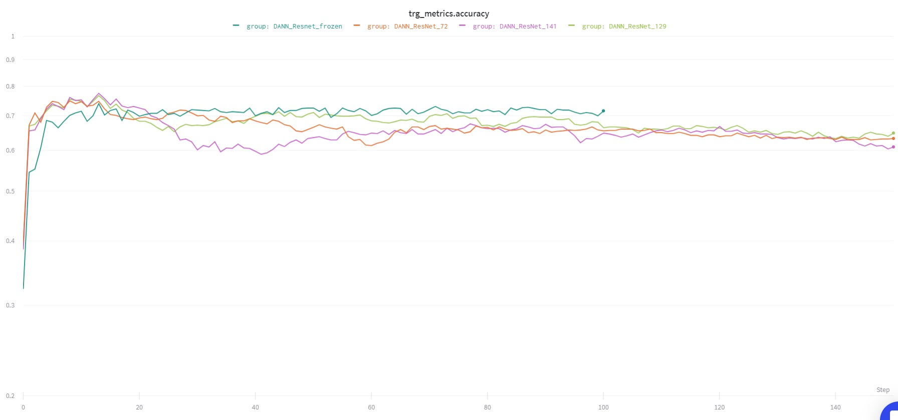
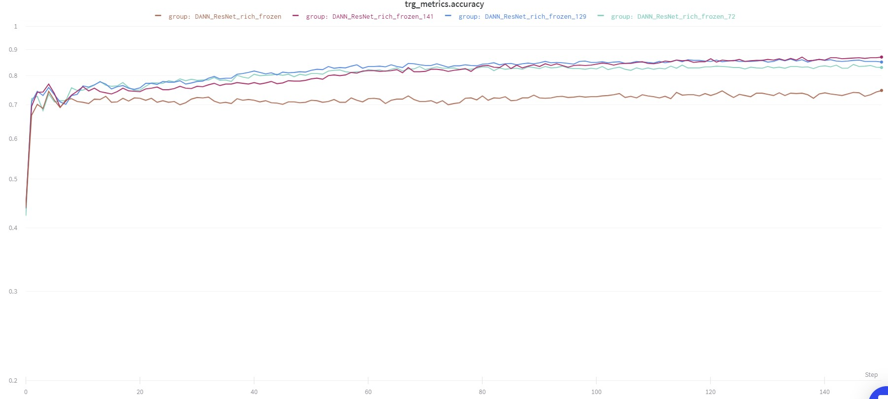
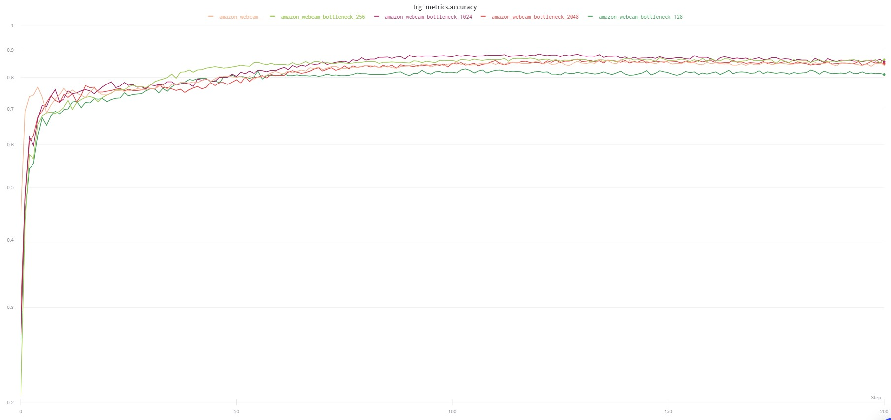

**Сроки**
Работу надо сдать до 25 мая, защита 8 июня. Я честно верила в доделку до начала июня, но зря. Поэтому числа 15-20 я пришлю почитать работу. 
Она будет небольшой, т.к. требований по объему у нас, кажется, нет, и работы прошлых лет по 20-35 листов встречаются.

Я пока не нашла никакого интересного датасета, хочу попробовать для начала поэкспериментировать с архитектурами на office, вдруг получится добиться разультатов лучше, чем в оригинальных статьях.
Тогда буду думать, что у меня в работе научная новизна)

**Глобальный план**

Попробовать добиться на DANN результатов лучше, чем в статье (по одному домену с ResNet уже получилось). Или хотя бы оценить влияние отдельных элементов архитектуры на результаты. 
Потом попробовать поэкспериментировать с SPL, подавая ему на вход фичи из ResNet и DANN в различных его вариациях. 

**План экспериментов:**

Все эксперименты будут на amazon->webcam, и может быть, если успеется, webcam->amazon, потому что webcam-dslr и обратно и так очень похожи и хорошо приближаются без domain adaptation, а amazon-dslr и обратно ведут себя примерно как amazon-webcam, но не рассматривались в оригинальной статье про DANN. 

1) Сделать FineTuning ResNet и AlexNet на source domain и оценить качество на target domain как бейзлайн  

`сделано для выбранной пары доменов для разного уровня разморозки сверток`

Чем больше размораживаешь, тем лучше качество.

**DANN**

1) Воспроизвести DANN на AlexNet и Resnet
    `сделано для части доменов, качество хуже, чем в статье, но как baseline для дальнейших экспериментов пойдет`
1) Поэкспериментировать с разморозкой сверточных слоев на Resnet:
    * Не размораживать
    `сделано`
    * Размораживать одну, две, три последних свертки
    `сделано для выбранной пары доменов для разного уровня разморозки сверток`
    
    При разморозке сверток качество на target сначала хорошо растет, потом быстро начинает падать. Гипотеза - domain loss слишком сильно воздействует на фичи, чтобы они были одинаковыми, что делает фичи target-домена менее пригодными для классификации. Возможные варианты решения - усложнить архитектуру классификатора, добавить adaptation block, перевзвешивать loss.
    
    * Размораживать, устанавливая разный Learning Rate для слоев классификатора и feature extractor
    `не делала пока, сначала попробую п. 4, 5`
1) Поэкспериментировать с архитектурой классификатора на AlexNet, ResNet
    * Сделать для ResNet классификатор как у AlexNet (в оригинальной архитектуре ResNet за свертками 1 полносвязный слой). Дальше буду называть его rich classifier.
    `сделала, качество улучшилось и даже перегнало результаты из обзора`
    
    
    
    Лучший результат при заморозке 141 слоя параметров. Надо будет перезапустить на большем количестве эпох.
    
    * Добавить ADAPTATION_BLOCK как в [статье](https://arxiv.org/pdf/1412.3474.pdf) и поэкспериментировать с его размером.
     
    `сделала, результаты довольно нестабильные. Для блока размера 1024 качество улучшилось, и для блока размер 256 осталось на примерно том же уровне. Плюс видно, что кривая роста метрики стала более гладкой. В общем, возможно, и есть какая-то польза от bottleneck, в виде избавления от лишней информации о домене, но это пока не точно`
    DANN_Resnet_Rich_bottleneck
    
    
    * ? Возможно, поэкспериментировать с добавлением Dropout в классификатор и доменный классификатор
    
    `оставлю на потом`
1) Поэкспериментировать с соотношением Domain Loss и Classification Loss для разных архитектур DANN с разморозкой сверток

`это уже точно работало для проблемы с ResNet без rich classifier. при соотношении 1.5-1.9 classification loss и 0.5-0.1 domain loss качество на target заметно растет. Но с добавлением rich классификатора проблема исчезла, не уверена, что эти эксперименты понадобятся`

**Результаты запусков [тут](https://app.wandb.ai/monkey_head/domain_adaptation)**, но там уже помойка и нужно очень постараться, чтобы найти что-то конкретное :(

**SPL**
[Статья](https://arxiv.org/pdf/1911.07982.pdf)
[Код](https://github.com/hellowangqian/domain-adaptation-capls)

Это та самая статья с кодом на матлабе, которую я рассказывала. Алгоритм принимает на вход эмбеддинги изображений (фичи из Resnet) и в несколько итераций проектирует элементы в латентное подпространство, делает над ними k-means и псевдо-лейблинг, каждую итерацию все больше элементов снабжая псевдо-лейблами. 

Я не научилась писать на матлабе и не нашла сломанного матлаба, чтобы поставить его себе, но нашла друга с матлабом, который готов позапускать код из репозитория на моих данных))

План такой:
1) Получить embeddings доменов из ResNet, нормализовать и прогнать через SPL (baseline) 
`Получилось, качество совпадает с результатами статьи`
2) Сделать fine-tuning ResNet на source domain, и использовать SPL на эмбеддингах source, target
`Сделала, качество сильно хуже чем в статье, при этом на обратной  паре доменов качество вырастает почти до единицы! Типа эмбеддинги для source хорошо кластеризуются, т.к. содержат информацию о метках`
3) Использовать SPL на эмбеддингах из пары лучших архитектур DANN на ResNet, например, базового DANN на Resnet с fine-tuning и DANN c rich classifier (для этой архитектуры можно попробовать брать эмбеддинги с разных слоев классификатора)
`не начинала, сначала нужно довести до ума эксперименты с DANN`

Результаты

Model | A → W | W → A |
--- | --- | --- | 
DANN Alexnet Статья | 0.73 |
DANN Resnet Обзор | 0.826 | 0.661
OneDomain ResNet Frozen | 0.6862 |
OneDomain ResNet Frozen 141 | 0.7318 |
OneDomain ResNet Frozen 129 | 0.74870 |
OneDomain ResNet Frozen 72 | **0.76042** |
DANN ResNet Frozen* | 0.73698 |
DANN ResNet Frozen** 141 | **0.76953** |
DANN ResNet Frozen** 129 | 0.76302 |
DANN ResNet Frozen** 72 | 0.74740 |
DANN Rich ResNet Frozen | 0.74740 |
DANN Rich ResNet Frozen 141 | **0.85677** | 0.70916 |
DANN Rich ResNet Frozen 129 | 0.85807 |
DANN Rich ResNet Frozen 72 | 0.83464 |
DANN Rich ResNet Frozen 141 Bottleneck 128 | 0.81771 |
DANN Rich ResNet Frozen 141 Bottleneck 256 | **0.86328** | 0.70881 |
DANN Rich ResNet Frozen 141 Bottleneck 256 domain_loss 0.5 | | **запущено** |
DANN Rich ResNet Frozen 141 Bottleneck 512 | 0.84896 | **запущено**
DANN Rich ResNet Frozen 141 Bottleneck 1024 | **0.87891** | **0.71626** |
DANN Rich ResNet Frozen 141 Bottleneck 1024 domain_loss 0.5 | | **запущено** |
DANN Rich ResNet Frozen 141 Bottleneck 2048 | 0.86068 | **запущено** 

Model | A → W | W → A |
--- | --- | --- | 
SPL Статья | 0.927 | 0.768 |
SPL Pure ResNet | **0.927** |
SPL ResNet Frozen 72 | 0.862 | **?** |
SPL DANN Rich ResNet Frozen 141 after convs | 0.927 | **выгрузила** |
SPL DANN Rich ResNet Frozen 141 before classifier | 0.923 | **выгрузила** |
SPL DANN Rich ResNet Frozen 141 Bottleneck 256 after convs | **0.931** | **?** |
SPL DANN Rich ResNet Frozen 141 Bottleneck 256 before bottleneck | 0.922 |
SPL DANN Rich ResNet Frozen 141 Bottleneck 256 before classifier | 0.881 |
SPL DANN Rich ResNet Frozen 141 Bottleneck 1024 after convs | **?** | **?** |

*- это тоже самое, что и OneDomain ResNet Frozen, т.к. в DANN Resnet после выходов сверток только один слой классификатора. Доменный лос берет фичи прямо с уровня сверток. И не обновляет свертки, потому что они заморожены

** лучшее качество достигается не в конце обучения, я сама выбирала лучший результат по валидации, что в unsupervised-условиях невозможно.
